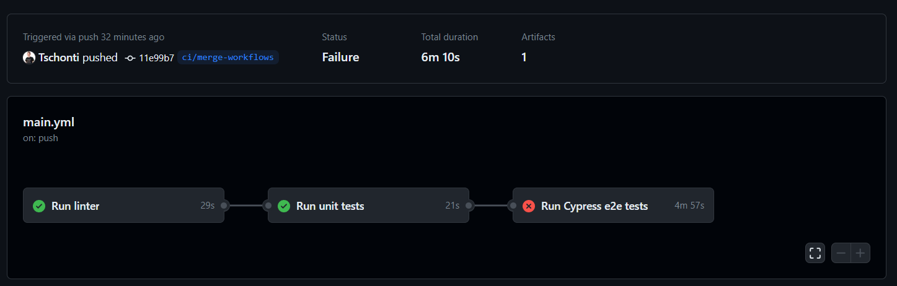
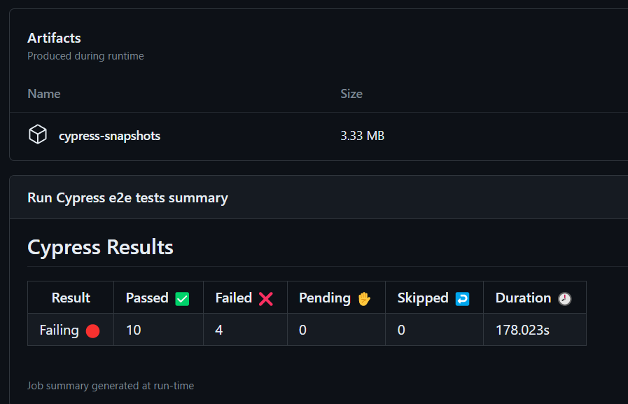

# Continuous Integration beüzemelése

A Continuous Integration lényege, hogy a kódbázishoz tartozó teszteket automatikusan futtatjuk új változtatások elkészültekor. Amennyiben a korábbi kód teszt lefedettsége nagy, ezzel könnyen bebiztosíthatjuk, hogy az új változtatásunk nem tört el dolgokat. Ebben a projektben már szerepelt két egyszerű unit teszt, valamint a tárgy során beállítottuk még a statikus kódellenőrzést és készítettünk UI teszteket is, ezeket fogjuk CI-ban futtatni.

## GitHub Actions workflow
CI eszköznek a GitHub Actionst használtam, mert ennek az eredményei rögtön a repóban láthatóak és nagyon sok elkészített job van hozzá a gyakran futtatott csomagokhoz. A workflow-t egy `yaml` fájlban kell leírni és a `.github` mappába kell tenni. Ebben először is megadom, hogy a repóban minden push-ra fusson le ez a pipeline. Ezután job-okat definiálok, minden tesztnek egyet. Ezeknek meg lehet adni, hogy melyik másikaktól függnek, így meg lehet adni a sorrendet. Úgy definiáltam a jobokat, hogy előszőr a statikus analízis fusson, majd a unit tesztek, végül pedig a UI tesztek. Ha valamelyik elfailel, akkor az attól függő jobok már nem fognak lefutni.

## Statikus analízis futtatása
Ez a job egy másik feladatba felsetupolt statikus ellenőrzést fog futtatni. Ehhez a következő lépéseket hajtja végre:
- Checkout-olja a repót
- Telepíti a Node 16-ot
- Telepíti a dependenciákat
- Majd futtatja az ESLint-et

Mind a három lépés mások által elkészített job-ot futtat. Ez az egyik nagy előnye a Github Actionsnek, hogy ezeket nem kell magunknak leírni, nyilván nem mi vagyunk az elsők akik szeretnénk ESLint-et futtatni egy repón.

## Unit tesztek futtatása
Az előző jobhoz nagyon hasonló, csak utolsó lépésben a repóban definiált `npm test` parancsot futtatjuk, ami a unit teszteket futtatja.

## UI tesztek futtatása
Ezek valójában end-to-end tesztek, ezeknek a futtatásához a teljes alkamazásnak futnia kell, ezért bonyolultabb is a job. Az alkalmazás mellett az adatbázisnak is futnia kell, ezért a services pontban egy konténerben elindítunk egy mongodb adatbázist. Fontosak a health_check opciók, ezzel biztosítjuk, hogy a következő lépéseket nem kezdi el futtatni, amíg az adatbázis ténylegesen el nem indult. Ezután a Cypress által fejlesztett job-ot hívjuk, melynek meg kell adni az alkalmazás indításához szükséges parancsot (`npm start`), hiszen a tesztek közben a tényleges appnak futnia kell. Végül pedig a Cypress által generált képeket és videókat feltöltjük a repó artifactjai közé. Innen a többi workflow is elérhetné, de erre most nincs szükség. Viszont a tesztek futása után innen le lehet tölteni őket, és ezekkel például könnyebb kijavítani egy tesztet, ha az elfailel. A cypress job kimenete:
